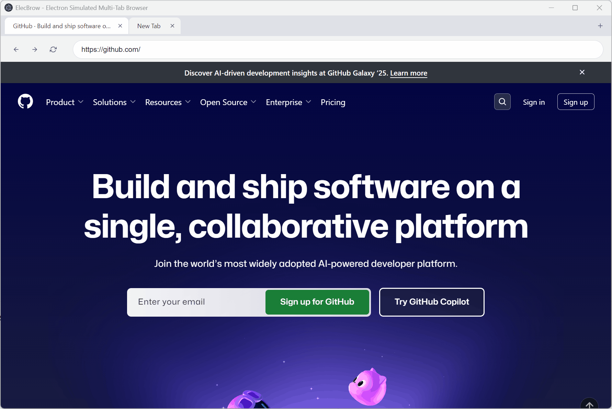

# ElecBrow

A simulated multi-tab browser built with Electron.

<p align="center"></p>

## Features ✨

- Multi-tab browsing with drag-and-drop tab reordering
- Address bar with navigation controls
- Can be embedded into existing Electron applications, or used as a standalone application
- Chrome DevTools Protocol (CDP) friendly. Easily connected via playwright-mcp

## Installation ⚙️

```bash
# Using npm
npm install elecbrow

# Using pnpm
pnpm add elecbrow
```

## Usage 🚀

### A minimum working example

See also [examples/simple.js](./examples/simple.js) .

```javascript
// In your Electron main process file
const { app } = require('electron');
const { createBrowser, configureRemoteDebugging } = require('elecbrow');

// Configure remote debugging before app is ready if you need
configureRemoteDebugging({
  enableRemoteDebugging: true,
  remoteDebuggingPort: 9222,
});

app.whenReady().then(() => {
  // Create a browser window
  const browserWindow = createBrowser({
    width: 1200,
    height: 800,
    startUrl: 'https://github.com',
    showDevTools: false,
  });

  // You can then use the returned BrowserWindow instance
  browserWindow.on('closed', () => {
    console.log('Browser window closed');
  });
});
```

### Connect via playwright-mcp

It's exactly recognized like a multi-tab Chrome browser if you've `enableRemoteDebugging`.

```sh
npx @modelcontextprotocol/inspector npx @playwright/mcp@latest --cdp-endpoint http://127.0.0.1:9222
```

## API 📚

### `configureRemoteDebugging(options?)`

Configures remote debugging for the Electron application. Must be called before app is ready.

#### Options

- `enableRemoteDebugging` (boolean) - Whether to enable remote debugging. Default: false
- `remoteDebuggingPort` (number) - Remote debugging port. Default: 9222

### `createBrowser(options?)`

Creates and opens an ElecBrow multi-tab browser window.

#### Options

- `width` (number) - Window width in pixels. Default: 1200
- `height` (number) - Window height in pixels. Default: 800
- `startUrl` (string) - Initial URL to load when the browser opens. Default: 'about:blank'
- `showDevTools` (boolean) - Whether to show developer tools on start. Default: false
- `userAgent` (string) - User agent string to use for browser requests. If not specified, will use Chrome's user agent.

#### Returns

- `BrowserWindow` - The created Electron BrowserWindow instance

## Development 🛠️

```bash
# Install dependencies
pnpm install
# Run in development mode
pnpm run dev
# Try the example
pnpm example
```

## Building 🏗️

```bash
# Build for production
pnpm run build

# Package as a standalone application
pnpm run package
```

## License 📄

MIT
