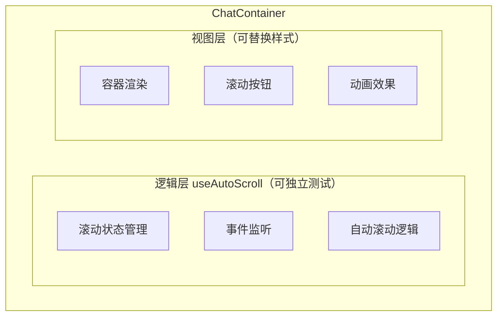

## 问题

接续问题 04，如何在 React/Vue 框架中优雅地封装这个逻辑？

## 回答

### 一、设计目标

封装一个高复用性的聊天容器组件，需要满足：

1. **开箱即用**：提供合理的默认行为
2. **可定制**：支持自定义滚动行为、样式、按钮等
3. **高性能**：内置虚拟滚动、节流等优化
4. **类型安全**：完善的 TypeScript 支持
5. **可测试**：逻辑与视图分离，便于单元测试

### 二、React 封装方案

#### 1. 核心 Hook：useAutoScroll

```typescript
// hooks/useAutoScroll.ts
import { useRef, useState, useCallback, useEffect, RefObject } from 'react'

export interface AutoScrollOptions {
  /** 底部判断阈值（像素） */
  threshold?: number
  /** 是否启用平滑滚动 */
  smoothScroll?: boolean
  /** 挂载时是否滚动到底部 */
  scrollOnMount?: boolean
  /** 滚动行为回调 */
  onScrollStateChange?: (isAtBottom: boolean) => void
}

export interface AutoScrollReturn<T extends HTMLElement> {
  /** 容器 ref */
  containerRef: RefObject<T>
  /** 滚动到底部 */
  scrollToBottom: (smooth?: boolean) => void
  /** 是否显示"回到底部"按钮 */
  showScrollButton: boolean
  /** 未读消息数量 */
  unreadCount: number
  /** 重置未读计数 */
  resetUnread: () => void
  /** 当前是否在底部 */
  isAtBottom: boolean
}

export function useAutoScroll<T extends HTMLElement = HTMLDivElement>(
  dependencies: React.DependencyList,
  options: AutoScrollOptions = {},
): AutoScrollReturn<T> {
  const {
    threshold = 50,
    smoothScroll = true,
    scrollOnMount = true,
    onScrollStateChange,
  } = options

  const containerRef = useRef<T>(null)
  const shouldAutoScrollRef = useRef(true)
  const [showScrollButton, setShowScrollButton] = useState(false)
  const [unreadCount, setUnreadCount] = useState(0)
  const [isAtBottom, setIsAtBottom] = useState(true)

  // 检查是否在底部
  const checkIfAtBottom = useCallback((): boolean => {
    const container = containerRef.current
    if (!container) return true

    const { scrollTop, scrollHeight, clientHeight } = container
    return scrollHeight - scrollTop - clientHeight <= threshold
  }, [threshold])

  // 滚动到底部
  const scrollToBottom = useCallback(
    (smooth: boolean = smoothScroll) => {
      const container = containerRef.current
      if (!container) return

      container.scrollTo({
        top: container.scrollHeight,
        behavior: smooth ? 'smooth' : 'instant',
      })

      shouldAutoScrollRef.current = true
      setShowScrollButton(false)
      setUnreadCount(0)
      setIsAtBottom(true)
    },
    [smoothScroll],
  )

  // 重置未读计数
  const resetUnread = useCallback(() => {
    setUnreadCount(0)
  }, [])

  // 处理滚动事件
  useEffect(() => {
    const container = containerRef.current
    if (!container) return

    let rafId: number | null = null

    const handleScroll = () => {
      // 使用 RAF 节流
      if (rafId) return

      rafId = requestAnimationFrame(() => {
        const atBottom = checkIfAtBottom()

        shouldAutoScrollRef.current = atBottom
        setIsAtBottom(atBottom)
        setShowScrollButton(!atBottom)

        if (atBottom) {
          setUnreadCount(0)
        }

        onScrollStateChange?.(atBottom)
        rafId = null
      })
    }

    const handleWheel = (e: WheelEvent) => {
      // 向上滚动时禁用自动滚动
      if (e.deltaY < 0) {
        shouldAutoScrollRef.current = false
        setShowScrollButton(true)
      }
    }

    container.addEventListener('scroll', handleScroll, { passive: true })
    container.addEventListener('wheel', handleWheel, { passive: true })

    // 挂载时滚动到底部
    if (scrollOnMount) {
      scrollToBottom(false)
    }

    return () => {
      container.removeEventListener('scroll', handleScroll)
      container.removeEventListener('wheel', handleWheel)
      if (rafId) cancelAnimationFrame(rafId)
    }
  }, [checkIfAtBottom, scrollOnMount, scrollToBottom, onScrollStateChange])

  // 依赖变化时处理滚动
  useEffect(() => {
    if (shouldAutoScrollRef.current) {
      requestAnimationFrame(() => scrollToBottom())
    } else {
      // 不在底部时增加未读计数
      setUnreadCount((prev) => prev + 1)
    }
  }, dependencies)

  return {
    containerRef,
    scrollToBottom,
    showScrollButton,
    unreadCount,
    resetUnread,
    isAtBottom,
  }
}
```

#### 2. 容器组件：ChatContainer

```tsx
// components/ChatContainer/index.tsx
import React, { ReactNode, CSSProperties } from 'react'
import { useAutoScroll, AutoScrollOptions } from '../../hooks/useAutoScroll'
import { ScrollToBottomButton } from './ScrollToBottomButton'
import styles from './ChatContainer.module.css'

export interface ChatContainerProps extends AutoScrollOptions {
  /** 消息列表 */
  children: ReactNode
  /** 消息依赖项，用于触发自动滚动检查 */
  messageDeps: React.DependencyList
  /** 容器类名 */
  className?: string
  /** 容器样式 */
  style?: CSSProperties
  /** 自定义"回到底部"按钮 */
  renderScrollButton?: (props: {
    onClick: () => void
    unreadCount: number
  }) => ReactNode
  /** 是否显示"回到底部"按钮 */
  showScrollToBottom?: boolean
}

export function ChatContainer({
  children,
  messageDeps,
  className = '',
  style,
  renderScrollButton,
  showScrollToBottom = true,
  ...scrollOptions
}: ChatContainerProps) {
  const { containerRef, scrollToBottom, showScrollButton, unreadCount } =
    useAutoScroll<HTMLDivElement>(messageDeps, scrollOptions)

  return (
    <div className={`${styles.wrapper} ${className}`} style={style}>
      <div ref={containerRef} className={styles.scrollContainer}>
        {children}
      </div>

      {showScrollToBottom &&
        showScrollButton &&
        (renderScrollButton ? (
          renderScrollButton({
            onClick: () => scrollToBottom(),
            unreadCount,
          })
        ) : (
          <ScrollToBottomButton
            onClick={() => scrollToBottom()}
            unreadCount={unreadCount}
          />
        ))}
    </div>
  )
}
```

```tsx
// components/ChatContainer/ScrollToBottomButton.tsx
import React from 'react'
import styles from './ChatContainer.module.css'

interface ScrollToBottomButtonProps {
  onClick: () => void
  unreadCount: number
}

export function ScrollToBottomButton({
  onClick,
  unreadCount,
}: ScrollToBottomButtonProps) {
  return (
    <button
      className={styles.scrollButton}
      onClick={onClick}
      aria-label={`回到最新消息${unreadCount > 0 ? `，${unreadCount}条未读` : ''}`}
    >
      <svg width="16" height="16" viewBox="0 0 16 16" fill="currentColor">
        <path d="M8 11.5l-5-5h10l-5 5z" />
      </svg>
      <span>回到最新</span>
      {unreadCount > 0 && (
        <span className={styles.badge}>{unreadCount > 99 ? '99+' : unreadCount}</span>
      )}
    </button>
  )
}
```

```css
/* components/ChatContainer/ChatContainer.module.css */
.wrapper {
  position: relative;
  height: 100%;
  display: flex;
  flex-direction: column;
}

.scrollContainer {
  flex: 1;
  overflow-y: auto;
  overflow-x: hidden;
  scroll-behavior: smooth;
  /* 优化滚动性能 */
  -webkit-overflow-scrolling: touch;
  overscroll-behavior: contain;
}

.scrollButton {
  position: absolute;
  bottom: 20px;
  left: 50%;
  transform: translateX(-50%);
  display: flex;
  align-items: center;
  gap: 6px;
  padding: 8px 16px;
  background: #1a73e8;
  color: white;
  border: none;
  border-radius: 20px;
  font-size: 14px;
  cursor: pointer;
  box-shadow: 0 2px 8px rgba(0, 0, 0, 0.2);
  transition: all 0.2s ease;
  z-index: 10;
}

.scrollButton:hover {
  background: #1557b0;
  transform: translateX(-50%) scale(1.05);
}

.scrollButton:active {
  transform: translateX(-50%) scale(0.98);
}

.badge {
  position: absolute;
  top: -8px;
  right: -8px;
  min-width: 20px;
  height: 20px;
  padding: 0 6px;
  background: #e53935;
  color: white;
  border-radius: 10px;
  font-size: 12px;
  font-weight: 500;
  display: flex;
  align-items: center;
  justify-content: center;
}
```

#### 3. 使用示例

```tsx
// 基础使用
function BasicChatPage() {
  const [messages, setMessages] = useState<Message[]>([])

  return (
    <ChatContainer messageDeps={[messages]}>
      {messages.map((msg) => (
        <MessageBubble key={msg.id} message={msg} />
      ))}
    </ChatContainer>
  )
}

// 自定义配置
function CustomChatPage() {
  const [messages, setMessages] = useState<Message[]>([])

  return (
    <ChatContainer
      messageDeps={[messages]}
      threshold={100}
      smoothScroll={true}
      onScrollStateChange={(isAtBottom) => {
        console.log('滚动状态:', isAtBottom ? '在底部' : '查看历史')
      }}
      renderScrollButton={({ onClick, unreadCount }) => (
        <MyCustomButton onClick={onClick}>
          {unreadCount > 0 ? `${unreadCount} 条新消息` : '回到底部'}
        </MyCustomButton>
      )}
    >
      {messages.map((msg) => (
        <MessageBubble key={msg.id} message={msg} />
      ))}
    </ChatContainer>
  )
}
```

#### 4. 支持虚拟滚动的高级版本

```tsx
// components/VirtualChatContainer/index.tsx
import React, { forwardRef, useCallback, useRef, useImperativeHandle } from 'react'
import { Virtuoso, VirtuosoHandle } from 'react-virtuoso'

export interface VirtualChatContainerProps<T> {
  messages: T[]
  renderMessage: (index: number, message: T) => React.ReactNode
  followOutput?: boolean | 'smooth' | 'auto'
  overscan?: number
  className?: string
}

export interface VirtualChatContainerRef {
  scrollToBottom: (behavior?: 'smooth' | 'auto') => void
  scrollToIndex: (index: number) => void
}

function VirtualChatContainerInner<T>(
  props: VirtualChatContainerProps<T>,
  ref: React.ForwardedRef<VirtualChatContainerRef>,
) {
  const {
    messages,
    renderMessage,
    followOutput = 'smooth',
    overscan = 200,
    className,
  } = props

  const virtuosoRef = useRef<VirtuosoHandle>(null)
  const atBottomRef = useRef(true)

  // 暴露给父组件的方法
  useImperativeHandle(
    ref,
    () => ({
      scrollToBottom: (behavior = 'smooth') => {
        virtuosoRef.current?.scrollToIndex({
          index: messages.length - 1,
          behavior,
        })
      },
      scrollToIndex: (index: number) => {
        virtuosoRef.current?.scrollToIndex({ index })
      },
    }),
    [messages.length],
  )

  // 跟踪是否在底部
  const handleAtBottomStateChange = useCallback((atBottom: boolean) => {
    atBottomRef.current = atBottom
  }, [])

  return (
    <Virtuoso
      ref={virtuosoRef}
      className={className}
      data={messages}
      itemContent={renderMessage}
      followOutput={followOutput}
      overscan={overscan}
      atBottomStateChange={handleAtBottomStateChange}
      atBottomThreshold={50}
      initialTopMostItemIndex={messages.length - 1}
    />
  )
}

// 使用 forwardRef 并保持泛型
export const VirtualChatContainer = forwardRef(VirtualChatContainerInner) as <T>(
  props: VirtualChatContainerProps<T> & {
    ref?: React.ForwardedRef<VirtualChatContainerRef>
  },
) => React.ReactElement
```

### 三、Vue 3 封装方案

#### 1. Composable：useAutoScroll

```typescript
// composables/useAutoScroll.ts
import { ref, onMounted, onUnmounted, watch, nextTick, Ref, WatchSource } from 'vue'

export interface AutoScrollOptions {
  threshold?: number
  smoothScroll?: boolean
  scrollOnMount?: boolean
}

export function useAutoScroll<T extends HTMLElement = HTMLDivElement>(
  watchSource: WatchSource | WatchSource[],
  options: AutoScrollOptions = {},
) {
  const { threshold = 50, smoothScroll = true, scrollOnMount = true } = options

  const containerRef = ref<T | null>(null)
  const shouldAutoScroll = ref(true)
  const showScrollButton = ref(false)
  const unreadCount = ref(0)
  const isAtBottom = ref(true)

  // 检查是否在底部
  const checkIfAtBottom = (): boolean => {
    const container = containerRef.value
    if (!container) return true

    const { scrollTop, scrollHeight, clientHeight } = container
    return scrollHeight - scrollTop - clientHeight <= threshold
  }

  // 滚动到底部
  const scrollToBottom = (smooth = smoothScroll) => {
    const container = containerRef.value
    if (!container) return

    container.scrollTo({
      top: container.scrollHeight,
      behavior: smooth ? 'smooth' : 'instant',
    })

    shouldAutoScroll.value = true
    showScrollButton.value = false
    unreadCount.value = 0
    isAtBottom.value = true
  }

  // 滚动事件处理
  let rafId: number | null = null

  const handleScroll = () => {
    if (rafId) return

    rafId = requestAnimationFrame(() => {
      const atBottom = checkIfAtBottom()

      shouldAutoScroll.value = atBottom
      isAtBottom.value = atBottom
      showScrollButton.value = !atBottom

      if (atBottom) {
        unreadCount.value = 0
      }

      rafId = null
    })
  }

  const handleWheel = (e: WheelEvent) => {
    if (e.deltaY < 0) {
      shouldAutoScroll.value = false
      showScrollButton.value = true
    }
  }

  // 监听数据变化
  watch(
    watchSource,
    () => {
      if (shouldAutoScroll.value) {
        nextTick(() => scrollToBottom())
      } else {
        unreadCount.value++
      }
    },
    { deep: true },
  )

  // 生命周期
  onMounted(() => {
    const container = containerRef.value
    if (container) {
      container.addEventListener('scroll', handleScroll, { passive: true })
      container.addEventListener('wheel', handleWheel, { passive: true })

      if (scrollOnMount) {
        scrollToBottom(false)
      }
    }
  })

  onUnmounted(() => {
    const container = containerRef.value
    if (container) {
      container.removeEventListener('scroll', handleScroll)
      container.removeEventListener('wheel', handleWheel)
    }
    if (rafId) cancelAnimationFrame(rafId)
  })

  return {
    containerRef,
    scrollToBottom,
    showScrollButton,
    unreadCount,
    isAtBottom,
    resetUnread: () => {
      unreadCount.value = 0
    },
  }
}
```

#### 2. ChatContainer 组件

```vue
<!-- components/ChatContainer.vue -->
<template>
  <div class="chat-container-wrapper" :class="wrapperClass" :style="wrapperStyle">
    <div ref="containerRef" class="chat-scroll-container">
      <slot></slot>
    </div>

    <Transition name="slide-up">
      <slot
        v-if="showScrollToBottom && showScrollButton"
        name="scrollButton"
        :on-click="() => scrollToBottom()"
        :unread-count="unreadCount"
      >
        <button
          class="scroll-to-bottom-btn"
          @click="scrollToBottom()"
          :aria-label="`回到最新消息${unreadCount > 0 ? `，${unreadCount}条未读` : ''}`"
        >
          <svg width="16" height="16" viewBox="0 0 16 16" fill="currentColor">
            <path d="M8 11.5l-5-5h10l-5 5z" />
          </svg>
          <span>回到最新</span>
          <span v-if="unreadCount > 0" class="badge">
            {{ unreadCount > 99 ? '99+' : unreadCount }}
          </span>
        </button>
      </slot>
    </Transition>
  </div>
</template>

<script setup lang="ts">
import { toRef, computed } from 'vue'
import { useAutoScroll } from '../composables/useAutoScroll'

interface Props {
  messages: any[]
  threshold?: number
  smoothScroll?: boolean
  scrollOnMount?: boolean
  showScrollToBottom?: boolean
  wrapperClass?: string
  wrapperStyle?: Record<string, string>
}

const props = withDefaults(defineProps<Props>(), {
  threshold: 50,
  smoothScroll: true,
  scrollOnMount: true,
  showScrollToBottom: true,
})

const emit = defineEmits<{
  (e: 'scrollStateChange', isAtBottom: boolean): void
}>()

const { containerRef, scrollToBottom, showScrollButton, unreadCount, isAtBottom } =
  useAutoScroll(() => props.messages, {
    threshold: props.threshold,
    smoothScroll: props.smoothScroll,
    scrollOnMount: props.scrollOnMount,
  })

// 暴露给父组件
defineExpose({
  scrollToBottom,
  isAtBottom,
})
</script>

<style scoped>
.chat-container-wrapper {
  position: relative;
  height: 100%;
  display: flex;
  flex-direction: column;
}

.chat-scroll-container {
  flex: 1;
  overflow-y: auto;
  overflow-x: hidden;
  -webkit-overflow-scrolling: touch;
  overscroll-behavior: contain;
}

.scroll-to-bottom-btn {
  position: absolute;
  bottom: 20px;
  left: 50%;
  transform: translateX(-50%);
  display: flex;
  align-items: center;
  gap: 6px;
  padding: 8px 16px;
  background: #1a73e8;
  color: white;
  border: none;
  border-radius: 20px;
  font-size: 14px;
  cursor: pointer;
  box-shadow: 0 2px 8px rgba(0, 0, 0, 0.2);
  transition: all 0.2s ease;
  z-index: 10;
}

.scroll-to-bottom-btn:hover {
  background: #1557b0;
  transform: translateX(-50%) scale(1.05);
}

.badge {
  position: absolute;
  top: -8px;
  right: -8px;
  min-width: 20px;
  height: 20px;
  padding: 0 6px;
  background: #e53935;
  color: white;
  border-radius: 10px;
  font-size: 12px;
  display: flex;
  align-items: center;
  justify-content: center;
}

/* 过渡动画 */
.slide-up-enter-active,
.slide-up-leave-active {
  transition: all 0.3s ease;
}

.slide-up-enter-from,
.slide-up-leave-to {
  opacity: 0;
  transform: translateX(-50%) translateY(20px);
}
</style>
```

#### 3. Vue 使用示例

```vue
<template>
  <ChatContainer
    :messages="messages"
    :threshold="100"
    @scroll-state-change="handleScrollState"
  >
    <MessageBubble v-for="msg in messages" :key="msg.id" :message="msg" />

    <!-- 自定义滚动按钮 -->
    <template #scrollButton="{ onClick, unreadCount }">
      <MyCustomButton @click="onClick">
        {{ unreadCount > 0 ? `${unreadCount} 条新消息` : '回到底部' }}
      </MyCustomButton>
    </template>
  </ChatContainer>
</template>

<script setup lang="ts">
import { ref } from 'vue'
import ChatContainer from './components/ChatContainer.vue'
import MessageBubble from './components/MessageBubble.vue'

const messages = ref<Message[]>([])

const handleScrollState = (isAtBottom: boolean) => {
  console.log('当前在底部:', isAtBottom)
}
</script>
```

### 四、封装设计的关键原则

#### 1. 关注点分离



#### 2. 组合优于继承

```typescript
// ✅ 推荐：通过组合使用
function MyChat() {
  const scroll = useAutoScroll([messages]);
  const virtual = useVirtualList(messages);
  const streaming = useStreamingHandler();

  // 组合多个功能
  return <ChatContainer {...scroll} {...virtual} />;
}

// ❌ 避免：过度抽象的类继承
class EnhancedChatContainer extends ChatContainer {
  // 难以维护和测试
}
```

#### 3. 插槽/Render Props 模式

```tsx
// React: Render Props
<ChatContainer
  renderMessage={(msg) => <CustomMessage message={msg} />}
  renderScrollButton={(props) => <CustomButton {...props} />}
/>

// Vue: 具名插槽
<ChatContainer>
  <template #default>...</template>
  <template #scrollButton="{ onClick }">...</template>
</ChatContainer>
```

### 五、单元测试

```typescript
// __tests__/useAutoScroll.test.ts
import { renderHook, act } from '@testing-library/react-hooks'
import { useAutoScroll } from '../hooks/useAutoScroll'

describe('useAutoScroll', () => {
  // 模拟 DOM 元素
  const mockContainer = {
    scrollHeight: 1000,
    scrollTop: 0,
    clientHeight: 500,
    scrollTo: jest.fn(),
    addEventListener: jest.fn(),
    removeEventListener: jest.fn(),
  }

  beforeEach(() => {
    jest.clearAllMocks()
  })

  it('should initialize with correct default values', () => {
    const { result } = renderHook(() => useAutoScroll([]))

    expect(result.current.showScrollButton).toBe(false)
    expect(result.current.unreadCount).toBe(0)
    expect(result.current.isAtBottom).toBe(true)
  })

  it('should scroll to bottom when called', () => {
    const { result } = renderHook(() => useAutoScroll([]))

    // 模拟 ref
    Object.defineProperty(result.current.containerRef, 'current', {
      value: mockContainer,
      writable: true,
    })

    act(() => {
      result.current.scrollToBottom()
    })

    expect(mockContainer.scrollTo).toHaveBeenCalledWith({
      top: mockContainer.scrollHeight,
      behavior: 'smooth',
    })
  })

  it('should increment unread count when not at bottom', () => {
    const { result, rerender } = renderHook(({ deps }) => useAutoScroll(deps), {
      initialProps: { deps: [1] },
    })

    // 模拟不在底部
    Object.defineProperty(result.current.containerRef, 'current', {
      value: { ...mockContainer, scrollTop: 0 },
      writable: true,
    })

    // 触发依赖变化
    rerender({ deps: [2] })

    // 应该增加未读计数
    expect(result.current.unreadCount).toBeGreaterThan(0)
  })
})
```

### 六、总结

| 封装要点     | React 方案        | Vue 方案          |
| ------------ | ----------------- | ----------------- |
| **逻辑复用** | Custom Hook       | Composable        |
| **组件封装** | 函数组件 + Props  | SFC + Props/Slots |
| **状态管理** | useRef + useState | ref + reactive    |
| **事件处理** | useEffect 内绑定  | onMounted 内绑定  |
| **类型支持** | TypeScript 泛型   | defineProps 类型  |
| **可定制性** | Render Props      | 具名插槽          |

核心原则：

1. **逻辑与视图分离**：Hook/Composable 处理逻辑，组件处理渲染
2. **合理的默认值**：开箱即用，但支持覆盖
3. **性能优先**：内置节流、RAF 优化
4. **完善的类型**：TypeScript 支持，提供良好的开发体验
