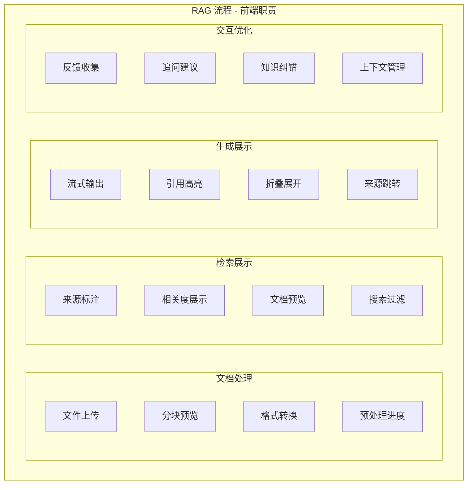

## 问题

前端如何参与 RAG (检索增强生成) 流程的展示优化？

## 回答

### 一、RAG 流程概述

RAG（Retrieval-Augmented Generation）是一种结合检索和生成的 AI 技术，主要流程：

```
用户问题 → 向量化 → 检索相关文档 → 构建上下文 → LLM 生成回答
```

前端可以在多个环节深度参与，提升用户体验和系统效率。

### 二、前端在 RAG 流程中的角色



### 三、文档预处理（Web Worker）

#### 1. 文档分块（Chunking）

```typescript
// workers/document-processor.worker.ts

interface ChunkOptions {
  chunkSize: number // 每块大小（字符数）
  chunkOverlap: number // 重叠大小
  separators?: string[] // 分隔符优先级
}

interface DocumentChunk {
  id: string
  content: string
  metadata: {
    source: string
    startIndex: number
    endIndex: number
    pageNumber?: number
  }
}

class DocumentChunker {
  private options: ChunkOptions

  constructor(options: ChunkOptions) {
    this.options = {
      chunkSize: 1000,
      chunkOverlap: 200,
      separators: ['\n\n', '\n', '. ', ' '],
      ...options,
    }
  }

  /**
   * 递归字符分割
   */
  chunk(text: string, metadata: { source: string }): DocumentChunk[] {
    const chunks: DocumentChunk[] = []
    const { chunkSize, chunkOverlap, separators } = this.options

    // 递归寻找最佳分割点
    const splitText = (text: string, separatorIndex: number): string[] => {
      if (text.length <= chunkSize) {
        return [text]
      }

      const separator = separators![separatorIndex]
      if (!separator) {
        // 没有更多分隔符，强制按长度切分
        const result: string[] = []
        for (let i = 0; i < text.length; i += chunkSize - chunkOverlap) {
          result.push(text.slice(i, i + chunkSize))
        }
        return result
      }

      const parts = text.split(separator)
      const result: string[] = []
      let current = ''

      for (const part of parts) {
        if ((current + separator + part).length <= chunkSize) {
          current = current ? current + separator + part : part
        } else {
          if (current) {
            result.push(current)
          }
          // 如果单个部分太长，递归用下一个分隔符
          if (part.length > chunkSize) {
            result.push(...splitText(part, separatorIndex + 1))
          } else {
            current = part
          }
        }
      }

      if (current) {
        result.push(current)
      }

      return result
    }

    const textChunks = splitText(text, 0)
    let startIndex = 0

    for (let i = 0; i < textChunks.length; i++) {
      const content = textChunks[i]
      chunks.push({
        id: `${metadata.source}-chunk-${i}`,
        content,
        metadata: {
          source: metadata.source,
          startIndex,
          endIndex: startIndex + content.length,
        },
      })
      startIndex += content.length - chunkOverlap
    }

    return chunks
  }
}

// Worker 消息处理
self.onmessage = async (event) => {
  const { type, payload } = event.data

  switch (type) {
    case 'chunk': {
      const { text, options, metadata } = payload
      const chunker = new DocumentChunker(options)
      const chunks = chunker.chunk(text, metadata)

      self.postMessage({
        type: 'chunk-result',
        payload: chunks,
      })
      break
    }

    case 'parse-pdf': {
      // 使用 pdf.js 解析 PDF
      const { arrayBuffer, filename } = payload
      const text = await parsePDF(arrayBuffer)

      self.postMessage({
        type: 'parse-result',
        payload: { text, filename },
      })
      break
    }
  }
}
```

#### 2. 主线程使用 Worker

```typescript
// hooks/useDocumentProcessor.ts
import { useCallback, useRef, useState } from 'react'

interface ProcessingProgress {
  stage: 'parsing' | 'chunking' | 'embedding' | 'complete'
  progress: number
  message: string
}

export function useDocumentProcessor() {
  const workerRef = useRef<Worker | null>(null)
  const [progress, setProgress] = useState<ProcessingProgress | null>(null)

  // 初始化 Worker
  const getWorker = useCallback(() => {
    if (!workerRef.current) {
      workerRef.current = new Worker(
        new URL('../workers/document-processor.worker.ts', import.meta.url),
      )
    }
    return workerRef.current
  }, [])

  // 处理文档
  const processDocument = useCallback(
    async (file: File, options?: ChunkOptions): Promise<DocumentChunk[]> => {
      const worker = getWorker()

      return new Promise(async (resolve, reject) => {
        setProgress({ stage: 'parsing', progress: 0, message: '解析文档...' })

        // 读取文件内容
        let text: string
        if (file.type === 'application/pdf') {
          const arrayBuffer = await file.arrayBuffer()
          worker.postMessage({
            type: 'parse-pdf',
            payload: { arrayBuffer, filename: file.name },
          })

          // 等待解析结果
          text = await new Promise((res) => {
            worker.onmessage = (e) => {
              if (e.data.type === 'parse-result') {
                res(e.data.payload.text)
              }
            }
          })
        } else {
          text = await file.text()
        }

        setProgress({ stage: 'chunking', progress: 50, message: '分块处理...' })

        // 分块
        worker.postMessage({
          type: 'chunk',
          payload: {
            text,
            options: options || { chunkSize: 1000, chunkOverlap: 200 },
            metadata: { source: file.name },
          },
        })

        worker.onmessage = (e) => {
          if (e.data.type === 'chunk-result') {
            setProgress({ stage: 'complete', progress: 100, message: '处理完成' })
            resolve(e.data.payload)
          }
        }

        worker.onerror = reject
      })
    },
    [getWorker],
  )

  // 清理
  const cleanup = useCallback(() => {
    workerRef.current?.terminate()
    workerRef.current = null
  }, [])

  return { processDocument, progress, cleanup }
}
```

### 四、前端向量化（Transformers.js）

使用 Transformers.js 在浏览器中进行文本向量化：

```typescript
// services/local-embedding.ts
import { pipeline, env } from '@xenova/transformers'

// 配置使用本地模型缓存
env.allowLocalModels = true
env.useBrowserCache = true

class LocalEmbeddingService {
  private embedder: any = null
  private loading: Promise<void> | null = null

  /**
   * 初始化 Embedding 模型
   */
  async init(modelName = 'Xenova/all-MiniLM-L6-v2') {
    if (this.embedder) return

    if (!this.loading) {
      this.loading = (async () => {
        console.log('加载 Embedding 模型...')
        this.embedder = await pipeline('feature-extraction', modelName, {
          progress_callback: (progress: any) => {
            console.log(`模型加载进度: ${(progress.progress * 100).toFixed(1)}%`)
          },
        })
        console.log('模型加载完成')
      })()
    }

    await this.loading
  }

  /**
   * 生成文本向量
   */
  async embed(text: string): Promise<number[]> {
    await this.init()

    const output = await this.embedder(text, {
      pooling: 'mean',
      normalize: true,
    })

    return Array.from(output.data)
  }

  /**
   * 批量生成向量
   */
  async embedBatch(texts: string[]): Promise<number[][]> {
    await this.init()

    const results: number[][] = []

    // 分批处理，避免内存溢出
    const batchSize = 10
    for (let i = 0; i < texts.length; i += batchSize) {
      const batch = texts.slice(i, i + batchSize)
      const embeddings = await Promise.all(batch.map((text) => this.embed(text)))
      results.push(...embeddings)
    }

    return results
  }

  /**
   * 计算余弦相似度
   */
  cosineSimilarity(a: number[], b: number[]): number {
    let dotProduct = 0
    let normA = 0
    let normB = 0

    for (let i = 0; i < a.length; i++) {
      dotProduct += a[i] * b[i]
      normA += a[i] * a[i]
      normB += b[i] * b[i]
    }

    return dotProduct / (Math.sqrt(normA) * Math.sqrt(normB))
  }

  /**
   * 本地向量搜索
   */
  async search(
    query: string,
    documents: Array<{ id: string; content: string; embedding?: number[] }>,
    topK = 5,
  ): Promise<Array<{ id: string; content: string; score: number }>> {
    const queryEmbedding = await this.embed(query)

    // 计算所有文档的相似度
    const scored = documents.map((doc) => ({
      ...doc,
      score: doc.embedding ? this.cosineSimilarity(queryEmbedding, doc.embedding) : 0,
    }))

    // 排序并返回 Top K
    return scored.sort((a, b) => b.score - a.score).slice(0, topK)
  }
}

export const localEmbedding = new LocalEmbeddingService()
```

### 五、检索结果展示

#### 1. 来源标注组件

```tsx
// components/SourceCitation/index.tsx
import React, { useState } from 'react'

interface Source {
  id: string
  title: string
  content: string
  relevanceScore: number
  url?: string
  pageNumber?: number
}

interface SourceCitationProps {
  sources: Source[]
  onSourceClick?: (source: Source) => void
}

export function SourceCitation({ sources, onSourceClick }: SourceCitationProps) {
  const [expanded, setExpanded] = useState<string | null>(null)

  return (
    <div className="source-citation">
      <h4>📚 参考来源 ({sources.length})</h4>

      <div className="source-list">
        {sources.map((source, index) => (
          <div
            key={source.id}
            className={`source-item ${expanded === source.id ? 'expanded' : ''}`}
          >
            <div
              className="source-header"
              onClick={() => setExpanded(expanded === source.id ? null : source.id)}
            >
              <span className="source-index">[{index + 1}]</span>
              <span className="source-title">{source.title}</span>
              <span className="relevance-badge">
                {(source.relevanceScore * 100).toFixed(0)}%
              </span>
            </div>

            {expanded === source.id && (
              <div className="source-content">
                <p>{source.content}</p>
                {source.url && (
                  <a
                    href={source.url}
                    target="_blank"
                    rel="noopener noreferrer"
                    className="source-link"
                  >
                    查看原文 →
                  </a>
                )}
              </div>
            )}
          </div>
        ))}
      </div>
    </div>
  )
}
```

#### 2. 答案中的引用高亮

```tsx
// components/AnswerWithCitations/index.tsx
import React, { useMemo } from 'react'

interface Citation {
  text: string
  sourceIndex: number
}

interface AnswerWithCitationsProps {
  answer: string
  citations: Citation[]
  sources: Source[]
  onCitationClick?: (sourceIndex: number) => void
}

export function AnswerWithCitations({
  answer,
  citations,
  sources,
  onCitationClick,
}: AnswerWithCitationsProps) {
  // 解析答案中的引用标记 [1], [2] 等
  const renderedAnswer = useMemo(() => {
    // 匹配引用标记 [1], [2], [1,2] 等
    const citationRegex = /\[(\d+(?:,\s*\d+)*)\]/g

    const parts: Array<{ type: 'text' | 'citation'; content: string }> = []
    let lastIndex = 0
    let match

    while ((match = citationRegex.exec(answer)) !== null) {
      // 添加引用前的文本
      if (match.index > lastIndex) {
        parts.push({
          type: 'text',
          content: answer.slice(lastIndex, match.index),
        })
      }

      // 添加引用标记
      parts.push({
        type: 'citation',
        content: match[1],
      })

      lastIndex = match.index + match[0].length
    }

    // 添加剩余文本
    if (lastIndex < answer.length) {
      parts.push({
        type: 'text',
        content: answer.slice(lastIndex),
      })
    }

    return parts
  }, [answer])

  return (
    <div className="answer-with-citations">
      {renderedAnswer.map((part, index) => {
        if (part.type === 'text') {
          return <span key={index}>{part.content}</span>
        }

        // 渲染引用标记
        const indices = part.content.split(',').map((s) => parseInt(s.trim()))
        return (
          <span key={index} className="citation-group">
            {indices.map((idx) => (
              <button
                key={idx}
                className="citation-badge"
                onClick={() => onCitationClick?.(idx)}
                title={sources[idx - 1]?.title}
              >
                [{idx}]
              </button>
            ))}
          </span>
        )
      })}
    </div>
  )
}
```

### 六、知识库文件上传组件

```tsx
// components/KnowledgeBaseUploader/index.tsx
import React, { useCallback, useState } from 'react'
import { useDocumentProcessor } from '../../hooks/useDocumentProcessor'
import { localEmbedding } from '../../services/local-embedding'

interface UploadedDocument {
  id: string
  filename: string
  chunks: DocumentChunk[]
  status: 'processing' | 'ready' | 'error'
  error?: string
}

export function KnowledgeBaseUploader({
  onDocumentsReady,
}: {
  onDocumentsReady: (docs: UploadedDocument[]) => void
}) {
  const [documents, setDocuments] = useState<UploadedDocument[]>([])
  const { processDocument, progress } = useDocumentProcessor()

  const handleFileSelect = useCallback(
    async (event: React.ChangeEvent<HTMLInputElement>) => {
      const files = Array.from(event.target.files || [])

      for (const file of files) {
        const docId = crypto.randomUUID()

        // 添加到列表，状态为处理中
        setDocuments((prev) => [
          ...prev,
          {
            id: docId,
            filename: file.name,
            chunks: [],
            status: 'processing',
          },
        ])

        try {
          // 分块处理
          const chunks = await processDocument(file)

          // 生成向量（可选，也可以在服务端做）
          const embeddings = await localEmbedding.embedBatch(
            chunks.map((c) => c.content),
          )

          // 附加向量到 chunks
          const chunksWithEmbeddings = chunks.map((chunk, i) => ({
            ...chunk,
            embedding: embeddings[i],
          }))

          setDocuments((prev) =>
            prev.map((doc) =>
              doc.id === docId
                ? { ...doc, chunks: chunksWithEmbeddings, status: 'ready' }
                : doc,
            ),
          )
        } catch (error) {
          setDocuments((prev) =>
            prev.map((doc) =>
              doc.id === docId
                ? { ...doc, status: 'error', error: (error as Error).message }
                : doc,
            ),
          )
        }
      }
    },
    [processDocument],
  )

  const handleRemove = useCallback((docId: string) => {
    setDocuments((prev) => prev.filter((d) => d.id !== docId))
  }, [])

  const handleSubmit = useCallback(() => {
    const readyDocs = documents.filter((d) => d.status === 'ready')
    onDocumentsReady(readyDocs)
  }, [documents, onDocumentsReady])

  return (
    <div className="knowledge-base-uploader">
      <div className="upload-area">
        <input
          type="file"
          multiple
          accept=".pdf,.txt,.md,.docx"
          onChange={handleFileSelect}
          id="file-input"
        />
        <label htmlFor="file-input">📄 点击或拖拽文件上传</label>
        <p className="hint">支持 PDF、TXT、Markdown、Word 文档</p>
      </div>

      {/* 处理进度 */}
      {progress && (
        <div className="processing-progress">
          <div className="progress-bar">
            <div className="progress-fill" style={{ width: `${progress.progress}%` }} />
          </div>
          <span>{progress.message}</span>
        </div>
      )}

      {/* 文档列表 */}
      <div className="document-list">
        {documents.map((doc) => (
          <div key={doc.id} className={`document-item ${doc.status}`}>
            <span className="filename">{doc.filename}</span>
            <span className="status">
              {doc.status === 'processing' && '⏳ 处理中...'}
              {doc.status === 'ready' && `✓ ${doc.chunks.length} 个片段`}
              {doc.status === 'error' && `❌ ${doc.error}`}
            </span>
            <button onClick={() => handleRemove(doc.id)} className="remove-btn">
              ×
            </button>
          </div>
        ))}
      </div>

      <button
        onClick={handleSubmit}
        disabled={!documents.some((d) => d.status === 'ready')}
        className="submit-btn"
      >
        确认上传知识库
      </button>
    </div>
  )
}
```

### 七、RAG 对话组件

```tsx
// components/RAGChat/index.tsx
import React, { useState, useCallback } from 'react'
import { SourceCitation } from '../SourceCitation'
import { AnswerWithCitations } from '../AnswerWithCitations'

interface RAGMessage {
  id: string
  role: 'user' | 'assistant'
  content: string
  sources?: Source[]
  citations?: Citation[]
}

export function RAGChat() {
  const [messages, setMessages] = useState<RAGMessage[]>([])
  const [input, setInput] = useState('')
  const [isLoading, setIsLoading] = useState(false)
  const [retrievedSources, setRetrievedSources] = useState<Source[]>([])

  const handleSubmit = useCallback(async () => {
    if (!input.trim() || isLoading) return

    const userMessage: RAGMessage = {
      id: crypto.randomUUID(),
      role: 'user',
      content: input,
    }

    setMessages((prev) => [...prev, userMessage])
    setInput('')
    setIsLoading(true)

    try {
      // 1. 检索相关文档
      const searchResponse = await fetch('/api/rag/search', {
        method: 'POST',
        headers: { 'Content-Type': 'application/json' },
        body: JSON.stringify({ query: input }),
      })
      const { sources } = await searchResponse.json()
      setRetrievedSources(sources)

      // 2. 生成回答（流式）
      const response = await fetch('/api/rag/generate', {
        method: 'POST',
        headers: { 'Content-Type': 'application/json' },
        body: JSON.stringify({
          query: input,
          sources: sources.map((s: Source) => s.content),
        }),
      })

      const reader = response.body!.getReader()
      const decoder = new TextDecoder()
      let fullContent = ''

      const assistantMessage: RAGMessage = {
        id: crypto.randomUUID(),
        role: 'assistant',
        content: '',
        sources,
      }

      setMessages((prev) => [...prev, assistantMessage])

      while (true) {
        const { done, value } = await reader.read()
        if (done) break

        const chunk = decoder.decode(value)
        fullContent += chunk

        setMessages((prev) =>
          prev.map((msg) =>
            msg.id === assistantMessage.id ? { ...msg, content: fullContent } : msg,
          ),
        )
      }
    } catch (error) {
      console.error('RAG 请求失败:', error)
    } finally {
      setIsLoading(false)
    }
  }, [input, isLoading])

  return (
    <div className="rag-chat">
      {/* 消息列表 */}
      <div className="message-list">
        {messages.map((msg) => (
          <div key={msg.id} className={`message ${msg.role}`}>
            {msg.role === 'assistant' ? (
              <>
                <AnswerWithCitations
                  answer={msg.content}
                  citations={msg.citations || []}
                  sources={msg.sources || []}
                />
                {msg.sources && msg.sources.length > 0 && (
                  <SourceCitation sources={msg.sources} />
                )}
              </>
            ) : (
              <p>{msg.content}</p>
            )}
          </div>
        ))}
      </div>

      {/* 检索预览面板 */}
      {isLoading && retrievedSources.length > 0 && (
        <div className="retrieval-preview">
          <h5>🔍 正在基于以下内容生成回答...</h5>
          {retrievedSources.slice(0, 3).map((source, idx) => (
            <div key={idx} className="preview-item">
              <strong>{source.title}</strong>
              <p>{source.content.slice(0, 100)}...</p>
            </div>
          ))}
        </div>
      )}

      {/* 输入区 */}
      <div className="input-area">
        <input
          value={input}
          onChange={(e) => setInput(e.target.value)}
          onKeyDown={(e) => e.key === 'Enter' && handleSubmit()}
          placeholder="输入问题..."
          disabled={isLoading}
        />
        <button onClick={handleSubmit} disabled={isLoading}>
          {isLoading ? '生成中...' : '发送'}
        </button>
      </div>
    </div>
  )
}
```

### 八、Worker 通信优化

解决 Worker 与主线程之间的序列化开销：

```typescript
// 使用 Transferable Objects 减少数据拷贝
// workers/embedding.worker.ts

self.onmessage = async (event) => {
  const { type, payload } = event.data

  if (type === 'embed-batch') {
    const { texts } = payload

    // 生成向量
    const embeddings = await generateEmbeddings(texts)

    // 转换为 Float32Array，使用 Transferable
    const buffer = new Float32Array(embeddings.flat())

    // 传输 buffer，不拷贝
    self.postMessage(
      {
        type: 'embed-result',
        payload: {
          buffer,
          dimensions: embeddings[0].length,
          count: embeddings.length,
        },
      },
      [buffer.buffer], // Transferable
    )
  }
}

// 主线程接收
worker.onmessage = (event) => {
  const { buffer, dimensions, count } = event.data.payload

  // 重建二维数组
  const embeddings: number[][] = []
  for (let i = 0; i < count; i++) {
    embeddings.push(Array.from(buffer.slice(i * dimensions, (i + 1) * dimensions)))
  }
}
```

### 九、总结

| 优化领域     | 实现方式                 | 效果           |
| ------------ | ------------------------ | -------------- |
| **文档处理** | Web Worker 分块          | 不阻塞主线程   |
| **向量化**   | Transformers.js 本地计算 | 减少服务端压力 |
| **来源展示** | 引用标注 + 折叠预览      | 清晰的溯源能力 |
| **流式生成** | SSE + 渐进式渲染         | 实时反馈       |
| **通信优化** | Transferable Objects     | 减少数据拷贝   |

前端在 RAG 流程中的价值：

1. **减轻服务端压力**：文档预处理、轻量向量化
2. **提升用户体验**：实时进度、来源透明
3. **增强可信度**：引用标注、来源跳转
4. **支持离线场景**：本地知识库、端侧模型
