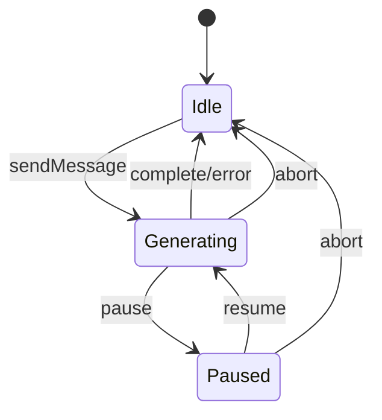

## 问题

如何实现一个支持多轮对话中断和重新生成的状态机？

## 回答

### 一、状态机设计

多轮对话的状态机需要处理复杂的交互场景：



### 二、类型定义

```typescript
// types/chat-state.ts

/** 对话状态 */
type ChatState = 'idle' | 'generating' | 'paused' | 'error'

/** 消息状态 */
type MessageStatus =
  | 'pending' // 等待发送
  | 'streaming' // 流式生成中
  | 'completed' // 生成完成
  | 'aborted' // 被中断
  | 'error' // 生成失败

/** 消息 */
interface Message {
  id: string
  role: 'user' | 'assistant' | 'system'
  content: string
  status: MessageStatus
  createdAt: number
  parentId?: string // 父消息 ID（用于分支）
  tokenCount?: number // Token 消耗
  regenerateCount?: number // 重新生成次数
}

/** 对话上下文 */
interface ChatContext {
  messages: Message[]
  state: ChatState
  activeMessageId: string | null // 当前正在生成的消息 ID
  error: Error | null
  abortController: AbortController | null
}

/** 动作类型 */
type ChatAction =
  | { type: 'SEND_MESSAGE'; payload: { content: string } }
  | { type: 'START_GENERATING'; payload: { messageId: string } }
  | { type: 'APPEND_TOKEN'; payload: { token: string } }
  | { type: 'COMPLETE_GENERATION'; payload: { tokenCount?: number } }
  | { type: 'ABORT_GENERATION' }
  | { type: 'PAUSE_GENERATION' }
  | { type: 'RESUME_GENERATION' }
  | { type: 'REGENERATE'; payload: { messageId: string } }
  | { type: 'EDIT_MESSAGE'; payload: { messageId: string; content: string } }
  | { type: 'SET_ERROR'; payload: { error: Error } }
  | { type: 'RESET' }
```

### 三、状态机 Reducer

```typescript
// reducers/chatReducer.ts

function chatReducer(state: ChatContext, action: ChatAction): ChatContext {
  switch (action.type) {
    case 'SEND_MESSAGE': {
      const userMessage: Message = {
        id: crypto.randomUUID(),
        role: 'user',
        content: action.payload.content,
        status: 'completed',
        createdAt: Date.now(),
      }

      const assistantMessage: Message = {
        id: crypto.randomUUID(),
        role: 'assistant',
        content: '',
        status: 'pending',
        createdAt: Date.now(),
        parentId: userMessage.id,
      }

      return {
        ...state,
        messages: [...state.messages, userMessage, assistantMessage],
        state: 'generating',
        activeMessageId: assistantMessage.id,
        abortController: new AbortController(),
      }
    }

    case 'START_GENERATING': {
      return {
        ...state,
        state: 'generating',
        messages: state.messages.map((msg) =>
          msg.id === action.payload.messageId ? { ...msg, status: 'streaming' } : msg,
        ),
      }
    }

    case 'APPEND_TOKEN': {
      return {
        ...state,
        messages: state.messages.map((msg) =>
          msg.id === state.activeMessageId
            ? {
                ...msg,
                content: msg.content + action.payload.token,
                status: 'streaming',
              }
            : msg,
        ),
      }
    }

    case 'COMPLETE_GENERATION': {
      return {
        ...state,
        state: 'idle',
        activeMessageId: null,
        abortController: null,
        messages: state.messages.map((msg) =>
          msg.id === state.activeMessageId
            ? {
                ...msg,
                status: 'completed',
                tokenCount: action.payload.tokenCount,
              }
            : msg,
        ),
      }
    }

    case 'ABORT_GENERATION': {
      // 中止当前请求
      state.abortController?.abort()

      return {
        ...state,
        state: 'idle',
        activeMessageId: null,
        abortController: null,
        messages: state.messages.map((msg) =>
          msg.id === state.activeMessageId ? { ...msg, status: 'aborted' } : msg,
        ),
      }
    }

    case 'PAUSE_GENERATION': {
      return {
        ...state,
        state: 'paused',
        messages: state.messages.map((msg) =>
          msg.id === state.activeMessageId
            ? { ...msg, status: 'streaming' } // 保持 streaming 状态
            : msg,
        ),
      }
    }

    case 'RESUME_GENERATION': {
      return {
        ...state,
        state: 'generating',
        abortController: new AbortController(), // 新的 controller
      }
    }

    case 'REGENERATE': {
      const targetIndex = state.messages.findIndex(
        (msg) => msg.id === action.payload.messageId,
      )

      if (targetIndex === -1) return state

      // 截断目标消息之后的所有消息
      const truncatedMessages = state.messages.slice(0, targetIndex)

      // 找到对应的用户消息
      const targetMessage = state.messages[targetIndex]
      const userMessage = state.messages.find(
        (msg) => msg.id === targetMessage.parentId,
      )

      if (!userMessage) return state

      // 创建新的 AI 回复
      const newAssistantMessage: Message = {
        id: crypto.randomUUID(),
        role: 'assistant',
        content: '',
        status: 'pending',
        createdAt: Date.now(),
        parentId: userMessage.id,
        regenerateCount: (targetMessage.regenerateCount || 0) + 1,
      }

      return {
        ...state,
        messages: [...truncatedMessages, newAssistantMessage],
        state: 'generating',
        activeMessageId: newAssistantMessage.id,
        abortController: new AbortController(),
      }
    }

    case 'EDIT_MESSAGE': {
      const targetIndex = state.messages.findIndex(
        (msg) => msg.id === action.payload.messageId,
      )

      if (targetIndex === -1) return state

      // 截断编辑消息之后的所有消息
      const truncatedMessages = state.messages.slice(0, targetIndex)

      // 更新编辑的消息
      const editedMessage: Message = {
        ...state.messages[targetIndex],
        content: action.payload.content,
        createdAt: Date.now(),
      }

      // 如果是用户消息，添加新的 AI 回复
      if (editedMessage.role === 'user') {
        const newAssistantMessage: Message = {
          id: crypto.randomUUID(),
          role: 'assistant',
          content: '',
          status: 'pending',
          createdAt: Date.now(),
          parentId: editedMessage.id,
        }

        return {
          ...state,
          messages: [...truncatedMessages, editedMessage, newAssistantMessage],
          state: 'generating',
          activeMessageId: newAssistantMessage.id,
          abortController: new AbortController(),
        }
      }

      return {
        ...state,
        messages: [...truncatedMessages, editedMessage],
      }
    }

    case 'SET_ERROR': {
      return {
        ...state,
        state: 'error',
        error: action.payload.error,
        activeMessageId: null,
        abortController: null,
        messages: state.messages.map((msg) =>
          msg.id === state.activeMessageId ? { ...msg, status: 'error' } : msg,
        ),
      }
    }

    case 'RESET': {
      state.abortController?.abort()
      return {
        messages: [],
        state: 'idle',
        activeMessageId: null,
        error: null,
        abortController: null,
      }
    }

    default:
      return state
  }
}
```

### 四、React Hook 封装

```typescript
// hooks/useChatStateMachine.ts
import { useReducer, useCallback, useRef, useEffect } from 'react'

const initialState: ChatContext = {
  messages: [],
  state: 'idle',
  activeMessageId: null,
  error: null,
  abortController: null,
}

export function useChatStateMachine() {
  const [context, dispatch] = useReducer(chatReducer, initialState)
  const abortControllerRef = useRef<AbortController | null>(null)

  // 同步 abortController 到 ref
  useEffect(() => {
    abortControllerRef.current = context.abortController
  }, [context.abortController])

  // 发送消息
  const sendMessage = useCallback(
    async (content: string) => {
      // 幂等性检查：如果正在生成，不允许发送
      if (context.state === 'generating') {
        console.warn('正在生成中，请等待完成或中止')
        return
      }

      dispatch({ type: 'SEND_MESSAGE', payload: { content } })

      // 等待下一个 tick 获取更新后的 state
      await new Promise((resolve) => setTimeout(resolve, 0))

      try {
        await generateResponse(content, abortControllerRef.current!.signal)
      } catch (error) {
        if ((error as Error).name === 'AbortError') {
          // 用户主动中止，不需要处理
          return
        }
        dispatch({ type: 'SET_ERROR', payload: { error: error as Error } })
      }
    },
    [context.state],
  )

  // 流式生成响应
  const generateResponse = async (userMessage: string, signal: AbortSignal) => {
    const messages = context.messages.filter((m) => m.status === 'completed')

    const response = await fetch('/api/chat', {
      method: 'POST',
      headers: { 'Content-Type': 'application/json' },
      body: JSON.stringify({
        messages: [
          ...messages.map((m) => ({ role: m.role, content: m.content })),
          { role: 'user', content: userMessage },
        ],
      }),
      signal,
    })

    if (!response.ok) {
      throw new Error(`HTTP ${response.status}`)
    }

    dispatch({
      type: 'START_GENERATING',
      payload: { messageId: context.activeMessageId! },
    })

    const reader = response.body!.getReader()
    const decoder = new TextDecoder()
    let tokenCount = 0

    while (true) {
      const { done, value } = await reader.read()
      if (done) break

      const chunk = decoder.decode(value)
      const lines = chunk.split('\n')

      for (const line of lines) {
        if (line.startsWith('data: ')) {
          const data = line.slice(6)
          if (data === '[DONE]') {
            dispatch({
              type: 'COMPLETE_GENERATION',
              payload: { tokenCount },
            })
            return
          }

          try {
            const parsed = JSON.parse(data)
            const token = parsed.choices?.[0]?.delta?.content || ''
            if (token) {
              tokenCount++
              dispatch({ type: 'APPEND_TOKEN', payload: { token } })
            }
          } catch {
            // 忽略解析错误
          }
        }
      }
    }

    dispatch({ type: 'COMPLETE_GENERATION', payload: { tokenCount } })
  }

  // 中止生成
  const abort = useCallback(() => {
    dispatch({ type: 'ABORT_GENERATION' })
  }, [])

  // 暂停生成
  const pause = useCallback(() => {
    dispatch({ type: 'PAUSE_GENERATION' })
    abortControllerRef.current?.abort()
  }, [])

  // 恢复生成
  const resume = useCallback(async () => {
    dispatch({ type: 'RESUME_GENERATION' })

    const activeMessage = context.messages.find((m) => m.id === context.activeMessageId)
    if (!activeMessage) return

    const userMessage = context.messages.find((m) => m.id === activeMessage.parentId)
    if (!userMessage) return

    // 从当前内容继续生成
    try {
      await continueGeneration(
        userMessage.content,
        activeMessage.content,
        abortControllerRef.current!.signal,
      )
    } catch (error) {
      if ((error as Error).name !== 'AbortError') {
        dispatch({ type: 'SET_ERROR', payload: { error: error as Error } })
      }
    }
  }, [context.messages, context.activeMessageId])

  // 重新生成
  const regenerate = useCallback(
    async (messageId: string) => {
      // 幂等性检查
      if (context.state === 'generating') {
        abort()
        await new Promise((resolve) => setTimeout(resolve, 100))
      }

      dispatch({ type: 'REGENERATE', payload: { messageId } })

      // 找到对应的用户消息
      const targetMessage = context.messages.find((m) => m.id === messageId)
      const userMessage = context.messages.find((m) => m.id === targetMessage?.parentId)

      if (!userMessage) return

      await new Promise((resolve) => setTimeout(resolve, 0))

      try {
        await generateResponse(userMessage.content, abortControllerRef.current!.signal)
      } catch (error) {
        if ((error as Error).name !== 'AbortError') {
          dispatch({ type: 'SET_ERROR', payload: { error: error as Error } })
        }
      }
    },
    [context.state, context.messages, abort],
  )

  // 编辑消息
  const editMessage = useCallback(
    async (messageId: string, newContent: string) => {
      // 幂等性检查
      if (context.state === 'generating') {
        abort()
        await new Promise((resolve) => setTimeout(resolve, 100))
      }

      dispatch({
        type: 'EDIT_MESSAGE',
        payload: { messageId, content: newContent },
      })

      const editedMessage = context.messages.find((m) => m.id === messageId)
      if (editedMessage?.role === 'user') {
        await new Promise((resolve) => setTimeout(resolve, 0))

        try {
          await generateResponse(newContent, abortControllerRef.current!.signal)
        } catch (error) {
          if ((error as Error).name !== 'AbortError') {
            dispatch({ type: 'SET_ERROR', payload: { error: error as Error } })
          }
        }
      }
    },
    [context.state, context.messages, abort],
  )

  // 重置对话
  const reset = useCallback(() => {
    dispatch({ type: 'RESET' })
  }, [])

  return {
    messages: context.messages,
    state: context.state,
    error: context.error,
    activeMessageId: context.activeMessageId,
    sendMessage,
    abort,
    pause,
    resume,
    regenerate,
    editMessage,
    reset,
    // 状态判断辅助方法
    isIdle: context.state === 'idle',
    isGenerating: context.state === 'generating',
    isPaused: context.state === 'paused',
    hasError: context.state === 'error',
  }
}
```

### 五、使用 XState 的高级实现

对于更复杂的状态机，推荐使用 XState：

```typescript
// machines/chatMachine.ts
import { createMachine, assign } from 'xstate'

interface ChatMachineContext {
  messages: Message[]
  activeMessageId: string | null
  abortController: AbortController | null
  error: Error | null
  tokenCount: number
}

type ChatMachineEvent =
  | { type: 'SEND'; content: string }
  | { type: 'TOKEN'; token: string }
  | { type: 'COMPLETE'; tokenCount: number }
  | { type: 'ABORT' }
  | { type: 'PAUSE' }
  | { type: 'RESUME' }
  | { type: 'REGENERATE'; messageId: string }
  | { type: 'EDIT'; messageId: string; content: string }
  | { type: 'ERROR'; error: Error }
  | { type: 'RESET' }

export const chatMachine = createMachine(
  {
    id: 'chat',
    initial: 'idle',
    context: {
      messages: [],
      activeMessageId: null,
      abortController: null,
      error: null,
      tokenCount: 0,
    } as ChatMachineContext,

    states: {
      idle: {
        on: {
          SEND: {
            target: 'generating',
            actions: 'addMessages',
          },
          REGENERATE: {
            target: 'generating',
            actions: 'prepareRegenerate',
          },
          EDIT: {
            target: 'generating',
            actions: 'editMessage',
            guard: 'isUserMessage',
          },
          RESET: {
            actions: 'resetContext',
          },
        },
      },

      generating: {
        entry: 'createAbortController',
        invoke: {
          src: 'streamResponse',
          onError: {
            target: 'error',
            actions: 'setError',
          },
        },
        on: {
          TOKEN: {
            actions: 'appendToken',
          },
          COMPLETE: {
            target: 'idle',
            actions: 'completeGeneration',
          },
          ABORT: {
            target: 'idle',
            actions: ['abortRequest', 'markAborted'],
          },
          PAUSE: {
            target: 'paused',
            actions: 'abortRequest',
          },
        },
      },

      paused: {
        on: {
          RESUME: {
            target: 'generating',
          },
          ABORT: {
            target: 'idle',
            actions: 'markAborted',
          },
        },
      },

      error: {
        on: {
          SEND: {
            target: 'generating',
            actions: 'addMessages',
          },
          REGENERATE: {
            target: 'generating',
            actions: 'prepareRegenerate',
          },
          RESET: {
            target: 'idle',
            actions: 'resetContext',
          },
        },
      },
    },
  },
  {
    actions: {
      addMessages: assign({
        messages: ({ context, event }) => {
          if (event.type !== 'SEND') return context.messages

          const userMessage: Message = {
            id: crypto.randomUUID(),
            role: 'user',
            content: event.content,
            status: 'completed',
            createdAt: Date.now(),
          }

          const assistantMessage: Message = {
            id: crypto.randomUUID(),
            role: 'assistant',
            content: '',
            status: 'pending',
            createdAt: Date.now(),
            parentId: userMessage.id,
          }

          return [...context.messages, userMessage, assistantMessage]
        },
        activeMessageId: ({ context }) => {
          // 返回最后一个消息的 ID（assistant）
          return crypto.randomUUID()
        },
      }),

      appendToken: assign({
        messages: ({ context, event }) => {
          if (event.type !== 'TOKEN') return context.messages

          return context.messages.map((msg) =>
            msg.id === context.activeMessageId
              ? { ...msg, content: msg.content + event.token, status: 'streaming' }
              : msg,
          )
        },
        tokenCount: ({ context }) => context.tokenCount + 1,
      }),

      completeGeneration: assign({
        messages: ({ context }) =>
          context.messages.map((msg) =>
            msg.id === context.activeMessageId
              ? { ...msg, status: 'completed', tokenCount: context.tokenCount }
              : msg,
          ),
        activeMessageId: null,
        abortController: null,
        tokenCount: 0,
      }),

      abortRequest: ({ context }) => {
        context.abortController?.abort()
      },

      markAborted: assign({
        messages: ({ context }) =>
          context.messages.map((msg) =>
            msg.id === context.activeMessageId ? { ...msg, status: 'aborted' } : msg,
          ),
        activeMessageId: null,
        abortController: null,
      }),

      createAbortController: assign({
        abortController: () => new AbortController(),
      }),

      setError: assign({
        error: ({ event }) => {
          if (event.type === 'ERROR') return event.error
          return null
        },
      }),

      resetContext: assign({
        messages: [],
        activeMessageId: null,
        abortController: null,
        error: null,
        tokenCount: 0,
      }),
    },

    guards: {
      isUserMessage: ({ context, event }) => {
        if (event.type !== 'EDIT') return false
        const msg = context.messages.find((m) => m.id === event.messageId)
        return msg?.role === 'user'
      },
    },
  },
)
```

### 六、React 组件集成

```tsx
// components/Chat/index.tsx
import React, { useState } from 'react'
import { useChatStateMachine } from '../../hooks/useChatStateMachine'

export function Chat() {
  const [input, setInput] = useState('')
  const {
    messages,
    state,
    sendMessage,
    abort,
    regenerate,
    editMessage,
    reset,
    isGenerating,
  } = useChatStateMachine()

  const handleSubmit = async (e: React.FormEvent) => {
    e.preventDefault()
    if (!input.trim() || isGenerating) return

    await sendMessage(input)
    setInput('')
  }

  return (
    <div className="chat-container">
      {/* 消息列表 */}
      <div className="messages">
        {messages.map((msg) => (
          <MessageItem
            key={msg.id}
            message={msg}
            onRegenerate={() => regenerate(msg.id)}
            onEdit={(content) => editMessage(msg.id, content)}
            isActive={msg.id === messages[messages.length - 1]?.id}
          />
        ))}
      </div>

      {/* 状态指示器 */}
      {state === 'generating' && (
        <div className="generating-indicator">
          <span>正在生成...</span>
          <button onClick={abort} className="abort-btn">
            ⏹ 停止
          </button>
        </div>
      )}

      {state === 'error' && (
        <div className="error-indicator">
          <span>生成出错，请重试</span>
        </div>
      )}

      {/* 输入区 */}
      <form onSubmit={handleSubmit} className="input-form">
        <input
          value={input}
          onChange={(e) => setInput(e.target.value)}
          placeholder="输入消息..."
          disabled={isGenerating}
        />
        <button type="submit" disabled={isGenerating || !input.trim()}>
          发送
        </button>
        <button type="button" onClick={reset}>
          新对话
        </button>
      </form>
    </div>
  )
}

// 消息项组件
function MessageItem({
  message,
  onRegenerate,
  onEdit,
  isActive,
}: {
  message: Message
  onRegenerate: () => void
  onEdit: (content: string) => void
  isActive: boolean
}) {
  const [isEditing, setIsEditing] = useState(false)
  const [editContent, setEditContent] = useState(message.content)

  const handleSaveEdit = () => {
    onEdit(editContent)
    setIsEditing(false)
  }

  return (
    <div className={`message ${message.role} ${message.status}`}>
      {isEditing ? (
        <div className="edit-mode">
          <textarea
            value={editContent}
            onChange={(e) => setEditContent(e.target.value)}
          />
          <div className="edit-actions">
            <button onClick={handleSaveEdit}>保存</button>
            <button onClick={() => setIsEditing(false)}>取消</button>
          </div>
        </div>
      ) : (
        <>
          <div className="content">
            {message.content}
            {message.status === 'streaming' && <span className="cursor">|</span>}
          </div>

          <div className="message-actions">
            {message.role === 'user' && (
              <button onClick={() => setIsEditing(true)}>✏️ 编辑</button>
            )}
            {message.role === 'assistant' && message.status !== 'streaming' && (
              <button onClick={onRegenerate}>🔄 重新生成</button>
            )}
            {message.tokenCount && (
              <span className="token-count">{message.tokenCount} tokens</span>
            )}
          </div>
        </>
      )}
    </div>
  )
}
```

### 七、幂等性保护

```typescript
// 使用锁机制防止重复操作
function useLock() {
  const lockRef = useRef(false)

  const acquire = useCallback(() => {
    if (lockRef.current) return false
    lockRef.current = true
    return true
  }, [])

  const release = useCallback(() => {
    lockRef.current = false
  }, [])

  return { acquire, release, isLocked: () => lockRef.current }
}

// 在操作中使用
const sendMessage = useCallback(async (content: string) => {
  if (!lock.acquire()) {
    console.warn('操作进行中，请稍候')
    return
  }

  try {
    // 执行发送逻辑...
  } finally {
    lock.release()
  }
}, [])
```

### 八、Token 消耗统计

```typescript
interface TokenUsage {
  totalTokens: number
  promptTokens: number
  completionTokens: number
  estimatedCost: number
}

function useTokenTracking() {
  const [usage, setUsage] = useState<TokenUsage>({
    totalTokens: 0,
    promptTokens: 0,
    completionTokens: 0,
    estimatedCost: 0,
  })

  const trackCompletion = useCallback(
    (promptTokens: number, completionTokens: number) => {
      setUsage((prev) => {
        const newTotal = prev.totalTokens + promptTokens + completionTokens
        return {
          totalTokens: newTotal,
          promptTokens: prev.promptTokens + promptTokens,
          completionTokens: prev.completionTokens + completionTokens,
          // GPT-4 价格估算：$0.03/1K prompt, $0.06/1K completion
          estimatedCost:
            prev.estimatedCost + promptTokens * 0.00003 + completionTokens * 0.00006,
        }
      })
    },
    [],
  )

  // 重新生成时扣减之前的 token
  const adjustForRegenerate = useCallback((previousTokens: number) => {
    setUsage((prev) => ({
      ...prev,
      completionTokens: prev.completionTokens - previousTokens,
      totalTokens: prev.totalTokens - previousTokens,
    }))
  }, [])

  return { usage, trackCompletion, adjustForRegenerate }
}
```

### 九、总结

| 功能           | 实现要点                   |
| -------------- | -------------------------- |
| **状态管理**   | Reducer + 明确的状态转换   |
| **中止逻辑**   | AbortController + 状态同步 |
| **重新生成**   | 截断消息 + 重建请求        |
| **编辑历史**   | 截断后续 + 分支处理        |
| **幂等性**     | 锁机制 + 状态检查          |
| **Token 统计** | 独立追踪 + 重生成调整      |

设计原则：

1. **单一数据源**：所有状态通过 reducer 管理
2. **不可变更新**：始终返回新的状态对象
3. **幂等操作**：多次调用相同操作不会产生副作用
4. **优雅降级**：中止和错误都有明确的恢复路径
