## 问题

React Fiber 架构是如何提升 AI 对话这种高频交互场景的响应性的？

## 回答

### 一、React Fiber 架构概述

Fiber 是 React 16 引入的新协调（Reconciliation）引擎，核心目标是实现**增量渲染**——将渲染工作拆分成多个小任务，分散到多帧执行。

```mermaid
gantt
    title 传统 Stack Reconciler
    dateFormat X
    axisFormat %s
    section 主线程
    同步 Diff + 更新（用户输入被阻塞！） :0, 100
```

```mermaid
gantt
    title Fiber Reconciler（可中断）
    dateFormat X
    axisFormat %s
    section 主线程
    工作单元 :0, 20
    空闲时间 :20, 30
    工作单元 :30, 50
    用户输入 :crit, 50, 60
    工作单元 :60, 80
```





> **可中断！用户输入可以立即响应！**

### 二、Fiber 的核心机制

#### 1. 时间分片（Time Slicing）

Fiber 将渲染工作拆分为多个**工作单元（Unit of Work）**，每个工作单元对应一个 Fiber 节点。

```javascript
// Fiber 节点结构（简化）
interface Fiber {
  type: any;                    // 组件类型
  key: string | null;
  stateNode: any;              // DOM 节点或组件实例
  child: Fiber | null;         // 第一个子节点
  sibling: Fiber | null;       // 兄弟节点
  return: Fiber | null;        // 父节点
  pendingProps: any;           // 新的 props
  memoizedProps: any;          // 上次渲染的 props
  memoizedState: any;          // 上次渲染的 state
  lanes: Lanes;                // 优先级
}
```

工作循环使用 `requestIdleCallback` 风格的调度：

```javascript
// React 的工作循环（简化示意）
function workLoop(deadline) {
  // 有剩余时间且有待处理的工作
  while (workInProgress !== null && deadline.timeRemaining() > 0) {
    // 处理一个工作单元
    workInProgress = performUnitOfWork(workInProgress)
  }

  // 如果还有工作，调度下一帧继续
  if (workInProgress !== null) {
    requestIdleCallback(workLoop)
  }
}
```

#### 2. 优先级调度

React 18 使用 **Lanes** 模型管理优先级：

```typescript
// 优先级从高到低
const SyncLane = 0b0000000000000001 // 同步，最高优先级
const InputContinuousLane = 0b0000000000000100 // 连续输入（如拖拽）
const DefaultLane = 0b0000000000010000 // 普通更新
const TransitionLane = 0b0000000001000000 // Transition 更新
const IdleLane = 0b0100000000000000 // 空闲优先级
```

**AI 对话场景中的优先级映射**：

| 操作            | 优先级              | 原因         |
| --------------- | ------------------- | ------------ |
| 用户输入        | SyncLane            | 必须立即响应 |
| 发送消息        | InputContinuousLane | 关键用户操作 |
| 流式 token 渲染 | TransitionLane      | 可延迟渲染   |
| Markdown 解析   | IdleLane            | 可后台处理   |

#### 3. 可中断渲染

Fiber 的关键能力是**可中断**。当高优先级任务到达时，可以暂停当前低优先级工作：

```javascript
function performUnitOfWork(fiber) {
  // 检查是否有更高优先级的任务
  if (shouldYieldToHost()) {
    // 暂停当前工作，让出主线程
    return null
  }

  // 继续处理当前 fiber
  const next = beginWork(fiber)

  if (next === null) {
    // 当前分支处理完毕，处理兄弟节点
    completeUnitOfWork(fiber)
  }

  return next
}
```

### 三、并发特性在 AI 对话中的应用

#### 1. useTransition：降低流式渲染优先级

```tsx
import { useState, useTransition } from 'react'

function StreamingChat() {
  const [messages, setMessages] = useState([])
  const [streamingContent, setStreamingContent] = useState('')
  const [isPending, startTransition] = useTransition()

  // 接收流式 token
  const handleToken = (token: string) => {
    // 使用 transition 降低优先级
    // 用户输入不会被阻塞
    startTransition(() => {
      setStreamingContent((prev) => prev + token)
    })
  }

  return (
    <div className="chat">
      {/* 消息列表 */}
      <MessageList messages={messages} />

      {/* 流式内容 - 可能稍有延迟渲染 */}
      <StreamingMessage
        content={streamingContent}
        isPending={isPending} // 可以显示加载指示
      />

      {/* 输入框 - 始终响应迅速 */}
      <ChatInput />
    </div>
  )
}
```

#### 2. useDeferredValue：延迟非关键内容

```tsx
import { useDeferredValue, useMemo } from 'react'
import { marked } from 'marked'

function MarkdownMessage({ content }: { content: string }) {
  // 延迟版本的内容，在高优先级更新时会使用旧值
  const deferredContent = useDeferredValue(content)

  // Markdown 解析使用延迟值
  const html = useMemo(() => {
    return marked.parse(deferredContent)
  }, [deferredContent])

  // 内容正在更新时的指示
  const isStale = content !== deferredContent

  return (
    <div
      className={`markdown-content ${isStale ? 'updating' : ''}`}
      dangerouslySetInnerHTML={{ __html: html }}
    />
  )
}
```

#### 3. 优先级分层的完整示例

```tsx
function AIChat() {
  // 高优先级：用户输入
  const [inputValue, setInputValue] = useState('')

  // 中优先级：消息列表
  const [messages, setMessages] = useState<Message[]>([])

  // 低优先级：流式内容
  const [isPending, startTransition] = useTransition()
  const deferredStreamingContent = useDeferredValue(streamingContent)

  // 用户输入 - 同步更新，最高优先级
  const handleInputChange = (e: React.ChangeEvent<HTMLInputElement>) => {
    setInputValue(e.target.value) // 立即响应
  }

  // 发送消息 - 高优先级
  const handleSend = () => {
    const userMessage = { role: 'user', content: inputValue }
    setMessages((prev) => [...prev, userMessage]) // 高优先级
    setInputValue('')
    startStreamingResponse(inputValue)
  }

  // 流式响应 - 使用 transition 降低优先级
  const startStreamingResponse = async (query: string) => {
    const response = await fetch('/api/chat', {
      method: 'POST',
      body: JSON.stringify({ query }),
    })

    const reader = response.body!.getReader()
    const decoder = new TextDecoder()

    while (true) {
      const { done, value } = await reader.read()
      if (done) break

      const token = decoder.decode(value)

      // 使用 transition 降低渲染优先级
      startTransition(() => {
        setStreamingContent((prev) => prev + token)
      })
    }
  }

  return (
    <div className="chat-container">
      <div className="messages">
        {messages.map((msg, i) => (
          <MessageBubble key={i} message={msg} />
        ))}

        {/* 流式内容使用延迟值 */}
        {deferredStreamingContent && (
          <StreamingBubble
            content={deferredStreamingContent}
            isStale={streamingContent !== deferredStreamingContent}
          />
        )}
      </div>

      {/* 输入框始终流畅响应 */}
      <input
        value={inputValue}
        onChange={handleInputChange}
        placeholder="输入消息..."
      />
      <button onClick={handleSend}>发送</button>
    </div>
  )
}
```

### 四、Fiber 调度可视化

```
时间线 →

┌──────────────────────────────────────────────────────────────┐
│ 帧 1          │ 帧 2          │ 帧 3          │ 帧 4         │
├──────────────────────────────────────────────────────────────┤
│ [渲染 Fiber]  │ [用户输入!]   │ [渲染 Fiber]  │ [渲染 Fiber] │
│  ↓            │  ↓ 中断渲染   │  ↓            │  ↓           │
│ [工作单元1]   │ [处理输入]    │ [工作单元3]   │ [工作单元4]  │
│ [工作单元2]   │ [恢复渲染]    │               │              │
│ [让出主线程]  │ [工作单元2.5] │               │              │
└──────────────────────────────────────────────────────────────┘
                  ↑
                  高优先级任务插入，
                  低优先级任务被中断
```

### 五、如何正确使用 Concurrent 特性

#### 1. 识别适合使用 Transition 的场景

```tsx
// ✅ 适合：大量数据渲染、复杂计算
startTransition(() => {
  setSearchResults(performExpensiveSearch(query))
})

// ❌ 不适合：关键用户反馈
startTransition(() => {
  setInputValue(e.target.value) // 用户会感觉输入延迟
})
```

#### 2. 正确处理 Pending 状态

```tsx
function StreamingMessage({ content }: { content: string }) {
  const deferredContent = useDeferredValue(content)
  const isPending = content !== deferredContent

  return (
    <div className="message">
      {/* 实际渲染的是延迟内容 */}
      <MarkdownRenderer content={deferredContent} />

      {/* 显示正在更新的提示 */}
      {isPending && <span className="updating-indicator">...</span>}
    </div>
  )
}
```

#### 3. 避免过度使用

```tsx
// ❌ 过度使用：所有状态都用 transition
function BadExample() {
  const [isPending, startTransition] = useTransition()

  const handleClick = () => {
    startTransition(() => {
      setCount((c) => c + 1) // 简单操作不需要 transition
    })
  }
}

// ✅ 适度使用：只在需要时使用
function GoodExample() {
  const [isPending, startTransition] = useTransition()

  const handleClick = () => {
    setCount((c) => c + 1) // 简单操作直接更新
  }

  const handleComplexUpdate = () => {
    startTransition(() => {
      setLargeDataSet(processLargeData()) // 复杂操作使用 transition
    })
  }
}
```

### 六、性能对比

不使用并发特性 vs 使用并发特性：

```tsx
// 测试场景：流式输出 1000 个 token，同时用户在输入

// 不使用 Transition
function WithoutConcurrency() {
  const handleToken = (token) => {
    // 每个 token 都是同步高优先级更新
    setContent((prev) => prev + token)
  }
  // 结果：输入框可能卡顿
}

// 使用 Transition
function WithConcurrency() {
  const [, startTransition] = useTransition()

  const handleToken = (token) => {
    startTransition(() => {
      setContent((prev) => prev + token)
    })
  }
  // 结果：输入框始终流畅
}
```

### 七、Fiber 调度的底层原理

```javascript
// React 内部调度器简化示意
const Scheduler = {
  taskQueue: [],
  currentTask: null,

  scheduleCallback(priority, callback) {
    const task = {
      callback,
      priority,
      expirationTime: this.getExpirationTime(priority),
    }

    this.taskQueue.push(task)
    this.taskQueue.sort((a, b) => a.expirationTime - b.expirationTime)

    this.requestHostCallback(this.workLoop)
  },

  workLoop(deadline) {
    while (this.taskQueue.length > 0) {
      const task = this.taskQueue[0]

      // 检查是否应该让出主线程
      if (deadline.timeRemaining() < 5) {
        // 时间不够，下一帧继续
        this.requestHostCallback(this.workLoop)
        return
      }

      // 检查是否有更高优先级任务
      if (this.hasHigherPriorityWork(task)) {
        // 处理更高优先级任务
        continue
      }

      // 执行任务
      const result = task.callback()

      if (typeof result === 'function') {
        // 任务未完成，继续
        task.callback = result
      } else {
        // 任务完成，移除
        this.taskQueue.shift()
      }
    }
  },
}
```

### 八、常见误区

#### 1. 认为所有组件都会自动并发

```tsx
// ❌ 误解：React 18 自动使所有渲染并发
function App() {
  // 这不会自动使用并发特性
  const [data, setData] = useState([])
  return <List data={data} />
}

// ✅ 正确：需要显式使用并发 API
function App() {
  const [isPending, startTransition] = useTransition()
  const deferredData = useDeferredValue(data)

  return <List data={deferredData} />
}
```

#### 2. 忽略业务层面的优化

```tsx
// ❌ 只依赖 Fiber，不做业务优化
function BadStreamingChat() {
  return (
    <div>
      {messages.map((msg) => (
        // 每条消息都复杂解析
        <ExpensiveMarkdown key={msg.id} content={msg.content} />
      ))}
    </div>
  )
}

// ✅ 结合业务优化 + Fiber 特性
function GoodStreamingChat() {
  const deferredMessages = useDeferredValue(messages)

  return (
    <div>
      {deferredMessages.map((msg) => (
        // 使用 memo 避免不必要渲染
        <MemoizedMessage key={msg.id} message={msg} />
      ))}
    </div>
  )
}

const MemoizedMessage = memo(function Message({ message }) {
  // 使用缓存的 Markdown 解析结果
  const html = useMemo(() => marked.parse(message.content), [message.content])

  return <div dangerouslySetInnerHTML={{ __html: html }} />
})
```

### 九、总结

| Fiber 特性           | AI 对话场景应用     | 效果           |
| -------------------- | ------------------- | -------------- |
| **时间分片**         | 长消息列表渲染      | 避免页面卡顿   |
| **优先级调度**       | 用户输入 > 流式渲染 | 输入始终响应   |
| **可中断渲染**       | 打字时暂停渲染      | 无卡顿感       |
| **useTransition**    | 流式 token 更新     | 降低渲染优先级 |
| **useDeferredValue** | Markdown 解析       | 延迟非关键渲染 |

核心原则：

1. **用户交互最优先**：输入、点击等操作必须立即响应
2. **渐进式增强**：在基础优化上叠加并发特性
3. **测量优先**：用 Profiler 确认是否真正需要并发优化
4. **不要过度使用**：简单场景不需要并发 API
