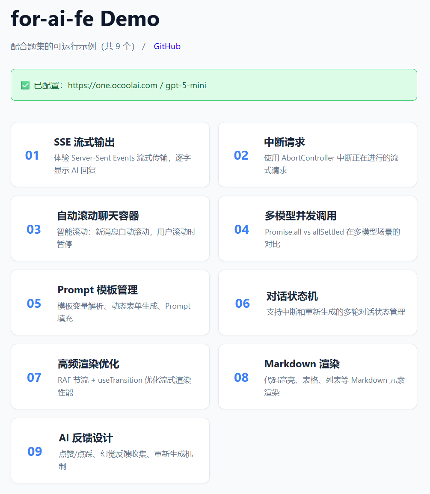

# for-ai-fe

<p align="center"></p>

给 AI 时代 Web 前端的新能力包。聚焦 AI 应用开发场景的前端技能，涵盖流式交互、性能优化、状态管理、多模态等核心主题。

> 相关内容扩充自小红书用户 曲行悠Man. 分享的面试经验。

## 目录

### 基础通信与流式处理

| 序号 | 题目                                                 | 关键词                    |
| :--: | ---------------------------------------------------- | ------------------------- |
|  01  | [SSE 与 WebSocket 区别](./01-SSE与WebSocket区别.md)  | SSE、WebSocket、流式传输  |
|  02  | [流式输出过程中断请求](./02-流式输出过程中断请求.md) | AbortController、请求中断 |

### 渲染性能优化

| 序号 | 题目                                                                 | 关键词             |
| :--: | -------------------------------------------------------------------- | ------------------ |
|  03  | [处理长文本渲染导致的页面卡顿](./03-处理长文本渲染导致的页面卡顿.md) | 虚拟滚动、异步渲染 |
|  04  | [实现自动滚动到底部的聊天容器](./04-实现自动滚动到底部的聊天容器.md) | 滚动检测、用户意图 |
|  05  | [React 中的聊天容器封装](./05-React中的聊天容器封装.md)              | Hooks、组件封装    |

### 异步与状态管理

| 序号 | 题目                                                                | 关键词                |
| :--: | ------------------------------------------------------------------- | --------------------- |
|  06  | [Promise.all 与 Promise.allSettled](./06-Promise-all-allSettled.md) | Promise、多模型调用   |
|  07  | [React 组件高频渲染优化](./07-React组件高频渲染.md)                 | memo、节流、性能优化  |
|  08  | [高频渲染与全局状态管理](./08-React组件高频渲染和全局状态管理.md)   | Zustand、Redux、Jotai |

### 业务组件设计

| 序号 | 题目                                                                         | 关键词                   |
| :--: | ---------------------------------------------------------------------------- | ------------------------ |
|  09  | [可扩展的 Prompt 模板管理组件](./09-设计可扩展的Prompt模板管理组件.md)       | 模板解析、变量表单       |
|  10  | [RAG 流程的展示优化](./10-RAG流程的展示优化.md)                              | 文档分块、本地 Embedding |
|  11  | [多轮对话中断和重新生成的状态机](./11-支持多轮对话中断和重新生成的状态机.md) | 状态机、XState           |

### 框架原理与架构

| 序号 | 题目                                                       | 关键词                  |
| :--: | ---------------------------------------------------------- | ----------------------- |
|  12  | [React Fiber 与高频响应性](./12-ReactFiber与高频响应性.md) | Fiber、时间切片、并发   |
|  13  | [工作流可视化编辑器设计](./13-工作流可视化编辑器.md)       | React Flow、DAG、插件化 |

### 工程化与监控

| 序号 | 题目                                                           | 关键词              |
| :--: | -------------------------------------------------------------- | ------------------- |
|  14  | [前端 AI 应用的质量监控体系](./14-前端AI应用的质量监控体系.md) | TTFT、TPS、链路追踪 |

### 前沿技术

| 序号 | 题目                                                         | 关键词             |
| :--: | ------------------------------------------------------------ | ------------------ |
|  15  | [多模态交互中的架构灵活性](./15-在多模态交互中保持灵活性.md) | 消息协议、渲染工厂 |
|  16  | [端侧模型 WebLLM](./16-端侧模型WebLLM.md)                    | WebGPU、本地推理   |
|  17  | [AI 幻觉的 UI 反馈设计](./17-AI幻觉的反馈设计.md)            | 置信度、事实检查   |

## 交互式 Demo

[examples](./examples) 目录包含 9 个可运行的交互式演示，支持 OpenAI 兼容的真实 LLM API 调用。

### 安装与配置

安装依赖：

```sh
cd examples
pnpm install
```

编辑 `.env.local`，填入你的 API 配置，例如：

```sh
VITE_API_BASE_URL=https://api.somewhere.com # 无需 /v1
VITE_API_KEY=sk-your-api-key
VITE_MODEL=gpt-5.1-mini
```

启动开发服务器：

```sh
pnpm dev
```

### Demo 列表

| Demo             | 主题     | 说明                               |
| ---------------- | -------- | ---------------------------------- |
| 01-SSE 流式输出  | 流式通信 | 使用 SSE 实现打字机效果的流式响应  |
| 02-中断请求      | 请求控制 | AbortController 实现流式请求的中断 |
| 03-自动滚动聊天  | 滚动优化 | 智能检测用户意图的自动滚动容器     |
| 04-多模型调用    | 并发请求 | Promise.allSettled 处理多模型并发  |
| 05-Prompt 模板   | 组件设计 | 可扩展的提示词模板管理系统         |
| 06-对话状态机    | 状态管理 | 支持中断/重新生成的多轮对话状态机  |
| 07-渲染优化      | 性能优化 | memo + 节流解决高频渲染问题        |
| 08-Markdown 渲染 | 内容渲染 | 流式 Markdown 渲染与代码高亮       |
| 09-反馈设计      | 用户体验 | AI 幻觉的反馈收集与处理机制        |

欢迎使用 [我的邀请链接](https://api.zetatechs.com/register?aff=2YsN) 注册中转站获取 LLM API 访问。

## License

MIT
