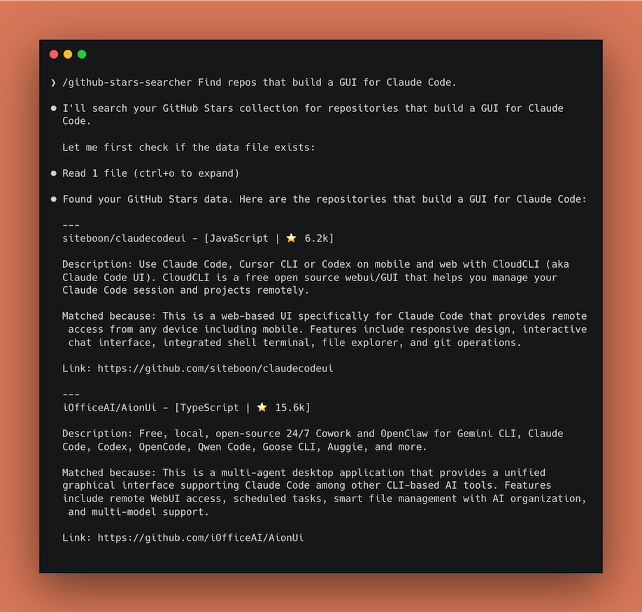

# Starbacks: Skills for GitHub Starred Repositories Semantic Search

English | [简体中文](README.zh-CN.md)

A set of Skills to collect your starred GitHub repositories and enable semantic search across them.

<div align="center">
  
</div>

## Motivation

GitHub's built-in starred repository search is limited: you can only search by repository name or basic keywords. When you've starred hundreds or thousands of repositories, finding a specific library from memory becomes extremely difficult.

Starbacks uses the GitHub API to collect your starred repository information and generates structured Markdown files. Based on this data, it leverages Claude Code / OpenCode to enable semantic search, allowing you to find the repository you need through natural language queries.

## Installation & Configuration

- Install Python dependencies

  ```bash
  uv sync
  ```

  Then restart your terminal to ensure you're using the created venv with PyGitHub.

- Configure GitHub Token

  Go to the [GitHub PAT generation page](https://github.com/settings/personal-access-tokens) to create a new Personal Access Token (PAT). Select `Public repositories` access and add `Starring` permission. Then add the token to the `.claude/skills/data/.env` file:

  ```
  GITHUB_TOKEN=github_pat_xxx
  ```

## Usage

### First Time: Collect Data

Run the `github-stars-collector` Skill:

```
/github-stars-collector
```

Wait for completion, data will be saved to `.claude/skills/data/stars/` as a directory structure.

### Daily Use: Search

Run the `github-stars-searcher` Skill:

```
/github-stars-searcher Help me find a React library for data visualization
```

### Update Database

When you star new repositories, run `github-stars-collector` again to fetch new additions:

```
/github-stars-collector
```

The collector supports incremental updates, only processing newly starred repositories.

## Data Format

Data is saved in `.claude/skills/data/stars/` as a directory structure. Each repository includes:

- `meta.json` - Repository metadata (name, description, language, stars, topics, URL)
- `README.md` - First 2000 chars of README
